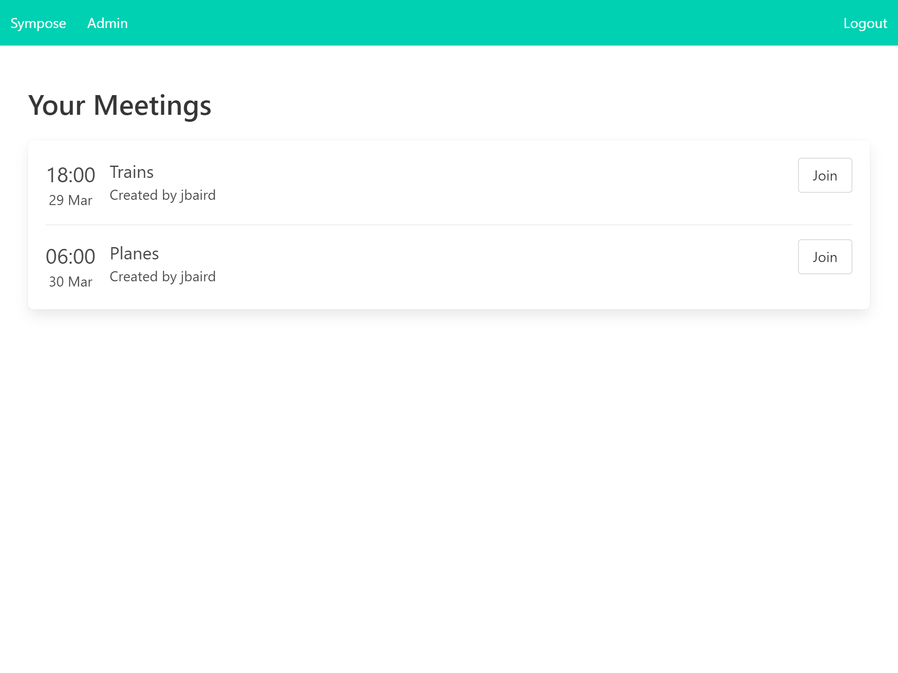

Sympose is a meeting management and authentication wrapper for Jitsi Meet.
Its purpose is to provide simple authentication and meeting management for private Jitsi Meet instances.
I created this to secure my own Jitsi Meet instance without the limitations of the internal plain authentication and
without having to configure LDAP. Sympose uses room-based JWTs to authorise users to Jitsi.



### Features
* Create meetings with subjects at an allotted time
* Assign attendees to meetings. Other users do not have access
* Use the power of Django's admin to manage meetings and users
* Allows creation of anonymous JWTs, so you can share a link to unregistered guests without having to open the server
* Automatically generates unique room names, to avoid collision with common meeting subjects
* Compatible with Jitsi Meet mobile apps. Will automatically authenticate using the JWT
* Automatically sets user's display name in Jitsi

### Installation
You will need to have your own Jitsi Meet instance. The easiest way to get started is to use
[Jitsi Meet on Docker](https://github.com/jitsi/docker-jitsi-meet).

Creating a [Python virtual environment](https://docs.python.org/3/library/venv.html) to run Sympose is recommended.
Once that is created, you can get started with

```
git clone https://github.com/bairdj/sympose.git
cd sympose
pip install -r requirements.txt
```

You then need to update settings in `sympose/settings.py`.
You will need to define your database connection (see Django docs) and all of the settings with the JITSI_ prefix.
Setting `JITSI_DOMAIN` is mandatory. The other settings can be left as default but you will probably want to change the secret.
These values should correspond with those set in your Docker/Jitsi configuration.

Once configured:
```
python manage.py migrate
python manage.py createsuperuser
python manage.py runserver
```

If deploying to production, see these [instructions](https://docs.djangoproject.com/en/3.0/howto/deployment/).
### Built using
* Django
* Bulma
* Jitsi Meet API

### Roadmap
* Send invitations
* Calendar invites
* Enhanced admin
* Better integration with Jitsi JS API
* Properly write JavaScript